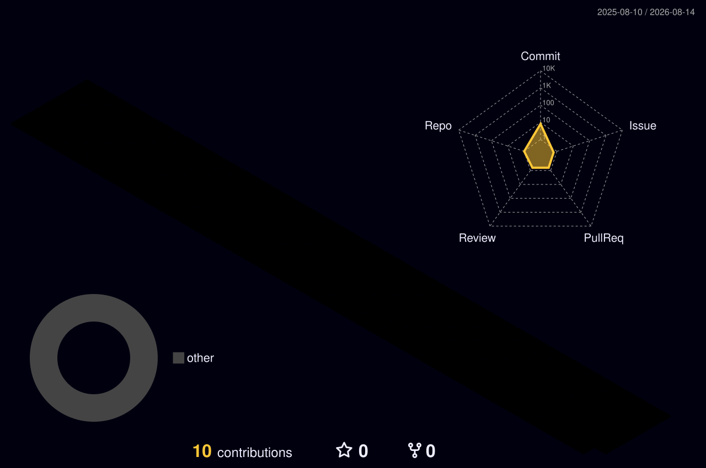

<p align="center">
  
</p>

<p align="center">
  <strong>CYBERSECURITY • DIGITAL FORENSICS • PRACTICAL LABS • RESEARCH</strong>
</p>

<p align="center">
  <a href="https://kemu.ac.ke">
    
  </a>
  
  
  
</p>

---

## `> whoami`

**DIGRAN** is a student-led cybersecurity and digital forensics workspace created by students at **Kenya Methodist University (KeMU)**.

This repository ecosystem serves as a practical environment for:

- 🔐 Cybersecurity
- 🕵️ Digital forensics
- 🌐 Networking
- 💻 Programming and automation
- 🧪 Security experimentation
- 📚 Lecturer-guided practicals
- 🚀 Independent projects
- 🔬 Research and technical exploration

> **Learn → Build → Break → Investigate → Document → Improve**

---

## `> mission`

DIGRAN is a growing technical archive documenting the practical journey through **Cybersecurity and Digital Forensics**.

The objective is simple:

```text
Understand the technology
        ↓
Understand how it can fail
        ↓
Understand how it can be attacked
        ↓
Understand how attacks can be investigated
        ↓
Build better defensive solutions
        ↓
Document everything
```

---

## `> contribution_matrix`

<p align="center">
  
</p>

<p align="center">
  <sub>
    Contribution activity visualized in 3D • Automatically generated by GitHub Actions
  </sub>
</p>

---

## `> contribution_activity`

<p align="center">
  <picture>
    <source
      media="(prefers-color-scheme: dark)"
      srcset="https://raw.githubusercontent.com/digran2026/digran2026/output/github-snake-dark.svg"
    />
    <source
      media="(prefers-color-scheme: light)"
      srcset="https://raw.githubusercontent.com/digran2026/digran2026/output/github-snake.svg"
    />
    
  </picture>
</p>

<p align="center">
  <sub>
    Contribution activity • Automatically generated by GitHub Actions
  </sub>
</p>

---

## `> ecosystem`

<p align="center">
  <strong>DIGRAN</strong> is continuously evolving through practical work,
  experimentation, documentation, and research.
</p>

<p align="center">
  <code>CYBERSECURITY</code>
  •
  <code>DIGITAL FORENSICS</code>
  •
  <code>NETWORKING</code>
  •
  <code>AUTOMATION</code>
  •
  <code>RESEARCH</code>
</p>

---

## `> philosophy`

```text
Learn
  ↓
Build
  ↓
Break
  ↓
Investigate
  ↓
Defend
  ↓
Document
  ↓
Improve
```

> **DIGRAN is not just a repository. It is a technical journey.**

---

## `> areas_of_focus`

<table>
  <tr>
    <td align="center" width="25%">
      <br/>
      <strong>Cybersecurity</strong><br/>
      <sub>Security, vulnerabilities, defense & ethical testing</sub>
    </td>
    <td align="center" width="25%">
      <br/>
      <strong>Digital Forensics</strong><br/>
      <sub>Evidence, investigation & forensic analysis</sub>
    </td>
    <td align="center" width="25%">
      <br/>
      <strong>Networking</strong><br/>
      <sub>Protocols, traffic & infrastructure</sub>
    </td>
    <td align="center" width="25%">
      <br/>
      <strong>Programming</strong><br/>
      <sub>Automation, scripting & security tooling</sub>
    </td>
  </tr>
</table>

### Core interests

```text
Cybersecurity
├── Network Security
├── Web Security
├── System Security
├── Vulnerability Analysis
├── Security Monitoring
└── Ethical Security Testing

Digital Forensics
├── Disk Forensics
├── File-System Analysis
├── Memory Forensics
├── Network Forensics
├── Timeline Analysis
└── Evidence Investigation

Networking
├── TCP/IP
├── DNS
├── DHCP
├── Routing
├── Packet Analysis
└── Network Security

Programming
├── Python
├── Bash
├── Automation
├── Data Processing
└── Security Tooling
```

---

## `> technology_stack`

<p align="center">
  
  
  
  
  
  
</p>

<p align="center">
  
  
  
  
</p>

> The technology stack will evolve as new laboratories, projects and research are added.

---

## `> practical_labs`

DIGRAN is designed around **hands-on learning**.

Practical laboratory work may include:

| Laboratory                | Purpose                                            |
| -------------------------- | --------------------------------------------------- |
| 🌐 Network Analysis       | Understand and investigate network traffic         |
| 🔐 Security Testing       | Explore vulnerabilities in controlled environments |
| 🐧 Linux Security         | Study system security and administration           |
| 🕵️ Digital Forensics      | Acquire and analyze digital evidence               |
| 🧪 Incident Investigation | Reconstruct security events                        |
| 📦 Packet Analysis        | Examine network communications                     |
| ⚙️ Security Automation    | Automate repetitive security tasks                 |
| 🔬 Experimental Labs      | Test concepts and document findings                |

All practical security testing should be conducted within **authorized and controlled environments**.

---

## `> projects`

Projects within DIGRAN will represent practical applications of the concepts being studied.

Each significant project should aim to document:

```text
Objective
   ↓
Environment
   ↓
Architecture
   ↓
Implementation
   ↓
Testing
   ↓
Security Considerations
   ↓
Results
   ↓
Lessons Learned
   ↓
Future Improvements
```

> Projects will be continuously added, reviewed and improved as the DIGRAN workspace develops.

---

## `> research`

Research is an important part of the DIGRAN ecosystem.

Potential research areas include:

- 🔎 Vulnerability research
- 🕵️ Digital forensic investigations
- 🌐 Network security analysis
- 🛡️ Defensive security
- 🧪 Security experimentation
- 🤖 Security automation
- 📊 Technical comparisons
- 📚 Literature and technical research

Research entries should prioritize **evidence, methodology, reproducibility and clear documentation**.

---

## `> documentation`

Documentation is treated as part of the technical work rather than an afterthought.

A DIGRAN technical write-up should answer:

```text
What was the objective?
        ↓
What environment was used?
        ↓
What methodology was followed?
        ↓
What happened?
        ↓
What evidence was collected?
        ↓
What was discovered?
        ↓
What can be improved?
```

The goal is to make practical work understandable to another student who encounters it later.

---

## `> roadmap`

```text
[████████████████████]  Foundation
        │
        ├── Repository established
        ├── README identity established
        ├── GitHub Actions configured
        └── Contribution visualizations deployed
        │
        ▼
[██████████████------]  Practical Development
        │
        ├── Cybersecurity laboratories
        ├── Digital forensics laboratories
        ├── Networking exercises
        └── Programming & automation
        │
        ▼
[██████████----------]  Project Development
        │
        ├── Security tools
        ├── Research projects
        ├── Technical write-ups
        └── Reproducible experiments
        │
        ▼
[████----------------]  Knowledge Archive
        │
        ├── Organized documentation
        ├── Project catalogue
        ├── Research archive
        └── Long-term technical portfolio
```

---

## `> principles`

DIGRAN follows a few simple principles:

```text
Learn before exploiting.
Understand before automating.
Preserve evidence.
Document the process.
Reproduce the result.
Respect authorization.
Improve continuously.
```

Security knowledge should be developed responsibly and applied only within environments where appropriate authorization exists.

---

## `> roadmap_status`

<p align="center">
  
  
  
  
</p>

---

## `> institution`

<p align="center">
  <strong>Kenya Methodist University</strong>
</p>

<p align="center">
  <a href="https://kemu.ac.ke">
    
  </a>
</p>

<p align="center">
  <em>Laborare Est Orare</em>
</p>

<p align="center">
  <sub>
    Student-led technical learning • Cybersecurity • Digital Forensics
  </sub>
</p>

<p align="center">
  
  &nbsp;info@kemu.ac.ke&nbsp;&nbsp;&nbsp;
  
  &nbsp;customercare@kemu.ac.ke&nbsp;&nbsp;&nbsp;
  
  &nbsp;+254724256162
</p>

---

## `> support`

<p align="center">
  <a href="http://digran.cloudflare.pay">
    
  </a>
</p>

<p align="center">
  <sub>
    Optional donations help cover DIGRAN's hosting and infrastructure costs
  </sub>
</p>

---

## `> status`

```text
DIGRAN STATUS
────────────────────────────────────────
Repository        ██████████  Active
Cybersecurity     ████████░░  Learning
Digital Forensics ████████░░  Learning
Networking        ███████░░░  Building
Programming       ███████░░░  Building
Research          ██████░░░░  Developing
Documentation     █████████░  Active
────────────────────────────────────────
```

> **Learning → Building → Investigating → Documenting**

---

## `> milestones`

- [x] Establish DIGRAN identity
- [x] Build README foundation
- [x] Add animated visual identity
- [x] Add 3D contribution visualization
- [x] Add contribution activity visualization
- [x] Establish technical areas
- [x] Establish documentation philosophy
- [ ] Document practical laboratories
- [ ] Rebuild and document projects
- [ ] Develop security tooling
- [ ] Publish research
- [ ] Build a structured knowledge archive

---

<p align="center">
  <strong>DIGRAN</strong>
</p>

<p align="center">
  <sub>
    Cybersecurity • Digital Forensics • Practical Labs • Research
  </sub>
</p>

<p align="center">
  <sub>
    Learn → Build → Break → Investigate → Document → Improve
  </sub>
</p>
